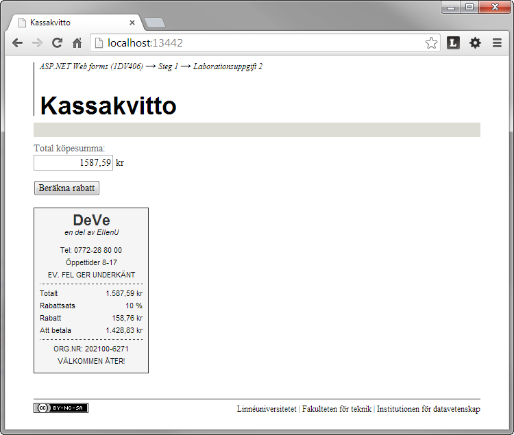

1.2 Kassakvitto
===============
[1-2-kassakvitto.pdf](https://github.com/1dv406/kursmaterial/raw/master/Laborationsuppgifter/1-2-kassakvitto.pdf)

"Skriv en webbapplikation där användaren matar in en total köpesumma. Beroende på köpesummans storlek ska en bestämd rabattsats tillämpas och beräkning av den erhållna rabatten och summan att betala ska ske och presenteras i form av ett kvitto."
